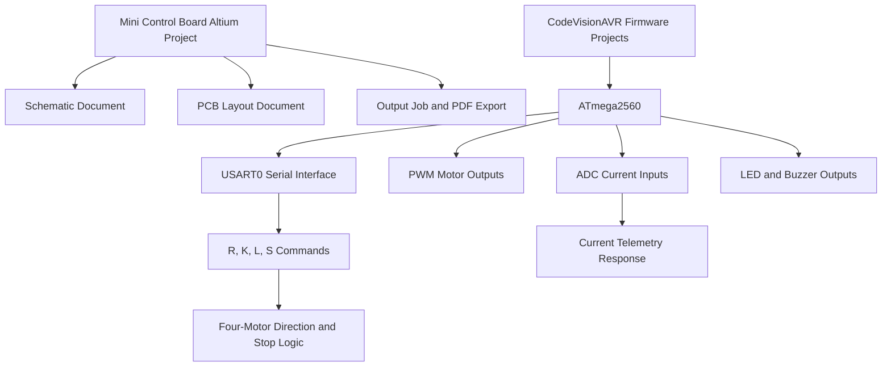
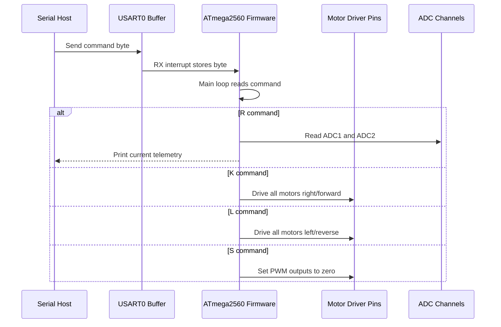

# Mini Controller Robot

ATmega2560 robot controller hardware and firmware archive with Altium board design files, PDF board documentation, and CodeVisionAVR motor-control firmware.

## Overview

Mini Controller Robot is a compact embedded robotics control project centered on a custom Altium PCB and AVR firmware for an ATmega2560-based motor controller. The repository combines the electrical design package with the microcontroller source and existing debug build outputs, making it useful as a reference point for board review, firmware recovery, bring-up, and future modernization.

The current firmware focuses on serial-commanded motor control, PWM drive outputs, basic LED/buzzer status behavior, and ADC reads for two current-sense channels. The hardware design is stored as native Altium project, schematic, PCB, output job, preview, and PDF files.

## Who This Is For

| Audience | Use Case |
|---|---|
| Robotics and embedded developers | Review or continue an ATmega2560 motor-controller design. |
| PCB designers | Open the Altium schematic and PCB files for design inspection or revision. |
| Firmware engineers | Study the CodeVisionAVR C firmware and existing compiled hex outputs. |
| Students and makers | Learn from a small robot-controller project that includes both board files and firmware. |

## What Is Included

| Area | Status | Source |
|---|---|---|
| Altium PCB project | Implemented | `Mini Control Board.PrjPcb` |
| Schematic document | Implemented | `Mini Control Board.SchDoc` |
| PCB layout document | Implemented | `Mini Control Board.PcbDoc` |
| Board PDF export | Implemented | `Mini Control Board.pdf` |
| Altium output job | Implemented | `Free Documents.OutJob` |
| Firmware source | Implemented | `MICRO TEST Version1 Source Code/*.c` |
| CodeVisionAVR projects | Implemented | `MICRO TEST Version1 Source Code/*.prj` |
| Atmel Studio wrappers | Present | `MICRO TEST Version1 Source Code/*.atsln`, `*.cproj` |
| Debug hex outputs | Present | `MICRO TEST Version1 Source Code/Debug/Exe/*.hex` |
| Automated tests and CI | Not yet documented | No test runner or workflow is present. |
| Manufacturing package | Requires validation | Output job references Gerber, NC Drill, BOM, and reports, but generated fabrication files are not committed. |

## Architecture

The repository has two main parts: an Altium hardware design and a firmware workspace. The firmware is written in C for CodeVisionAVR and targets an ATmega2560 running at 14.7456 MHz.



The Altium project owns the physical board definition. The firmware owns runtime behavior on the ATmega2560, including serial command parsing, PWM output registers, direction pins, current sensing, and indicator outputs.

## Runtime Flow



The strongest implemented firmware variant appears to be `PEM2.c`, which includes forward, reverse, stop, PWM, ADC current reads, serial RX/TX buffering, and LED/buzzer status outputs.

## Core Components

| Component | Responsibility | Inputs | Outputs | Source |
|---|---|---|---|---|
| Altium project | Groups the board, schematic, output definitions, and default configuration. | Altium project metadata | Design compile and output settings | `Mini Control Board.PrjPcb` |
| Schematic | Defines the circuit-level design. | Electrical symbols and nets | Schematic document and PDF output path | `Mini Control Board.SchDoc` |
| PCB layout | Defines the board layout. | Footprints, routing, board shape | Native PCB design file | `Mini Control Board.PcbDoc` |
| Output job | Stores documentation output configuration. | Altium design documents | Schematic/PCB print outputs | `Free Documents.OutJob` |
| Firmware projects | Preserve build settings for CodeVisionAVR. | C source, ATmega2560 target settings | COF, HEX, ROM, list, map outputs | `MICRO TEST Version1 Source Code/*.prj` |
| Runtime firmware | Parses serial commands and drives controller I/O. | USART0 bytes and ADC channels | PWM, direction pins, serial telemetry, indicators | `MICRO TEST Version1 Source Code/*.c` |

## Firmware Behavior

Verified from the committed source and project files:

| Behavior | Evidence |
|---|---|
| ATmega2560 target | `Chip type: ATmega2560` in source headers and `Chip=ATmega2560` in project files. |
| 14.7456 MHz clock | Source headers and project compiler settings. |
| USART0 serial communication | USART0 RX/TX interrupt buffers and 115200 baud initialization. |
| Four motor helper pairs | `Motor1_right/left` through `Motor4_right/left`. |
| PWM motor speed registers | `OCR2B`, `OCR4AL`, `OCR4BL`, and `OCR4CL` in `PEM2.c`. |
| Current reads | ADC helper reads channels 1 and 2 into `read_curr1` and `read_curr2`. |
| Serial commands | `R`, `K`, `L`, and `S` handlers in `PEM2.c`. |
| Status outputs | `led1`, `led2`, and `buzz` mapped to Port A bits. |

### Serial Command Interface

| Command | Implemented Action | Firmware Notes |
|---|---|---|
| `R` | Reads current channels and prints a telemetry line. | Uses ADC channels 1 and 2. |
| `K` | Drives all four motors in one direction. | Calls all `*_right` helpers. |
| `L` | Drives all four motors in the opposite direction. | Present in `PEM2.c`. |
| `S` | Stops PWM outputs and clears LEDs. | Present in `PEM2.c`. |

The exact mechanical direction depends on the motor wiring and driver stage, so the README describes `K` and `L` as firmware directions rather than verified robot motion directions.

## Technology Stack

| Layer | Technology | Purpose |
|---|---|---|
| PCB design | Altium Designer project files | Schematic, PCB layout, output definitions, and PDF export. |
| Microcontroller | ATmega2560 | Main embedded control target. |
| Firmware language | C | Motor-control and serial-command firmware. |
| Firmware generator/toolchain | CodeWizardAVR / CodeVisionAVR 3.12 Advanced | Generated peripheral setup and build project format. |
| IDE wrappers | Atmel Studio project/solution files | IDE project wrappers around the AVR source. |
| Serial transport | USART0 at 115200 baud | Host-to-controller command channel. |

## Quick Start

This repository does not currently include a one-command build script. Use the matching tool for the part of the project you want to inspect or rebuild.

### Inspect the Hardware Design

1. Install Altium Designer or another tool that can read Altium `.PrjPcb`, `.SchDoc`, and `.PcbDoc` files.
2. Open `Mini Control Board.PrjPcb`.
3. Review the linked schematic and PCB documents:
   - `Mini Control Board.SchDoc`
   - `Mini Control Board.PcbDoc`
4. Use `Mini Control Board.pdf` when you only need the exported board documentation.

### Inspect or Rebuild Firmware

1. Install CodeVisionAVR with ATmega2560 support. The committed project files were generated by CodeWizardAVR V3.12 Advanced.
2. Open one of the firmware project files under `MICRO TEST Version1 Source Code/`:
   - `PEM2.prj` for the most complete serial/PWM/current-read behavior.
   - `Version1.prj` for an earlier motor-control variant.
   - `PEM1.prj` for a PWM ramp test variant.
3. Rebuild from the IDE/toolchain.
4. Compare the generated output with the committed debug artifacts under `MICRO TEST Version1 Source Code/Debug/Exe/`.

### Existing Debug Outputs

Prebuilt debug outputs are committed for the firmware variants:

```text
MICRO TEST Version1 Source Code/Debug/Exe/
|-- PEM1.hex
|-- PEM2.hex
|-- Version1.hex
|-- PEM1.rom
|-- PEM2.rom
`-- Version1.rom
```

Treat these as historical build artifacts. Rebuild them with the verified toolchain before flashing hardware in a real robot.

## Configuration

There is no `.env` file or runtime configuration file. Important configuration currently lives inside the firmware source and CodeVisionAVR project settings.

| Setting | Verified Value | Source |
|---|---|---|
| MCU | `ATmega2560` | `*.c`, `*.prj`, `*.cproj` |
| Core clock | `14.745600 MHz` | Firmware headers and project settings |
| USART0 baud rate | `115200` | Firmware initialization comments/register setup |
| ADC reference | `AVCC` | ADC setup in `Version1.c` and `PEM2.c` |
| Debug build output | `Debug/Exe` and `Debug/List` | CodeVisionAVR project settings |

## Folder Structure

```text
mini-controller-robot/
|-- README.md
|-- Mini Control Board.PrjPcb          # Altium PCB project
|-- Mini Control Board.SchDoc          # Altium schematic document
|-- Mini Control Board.PcbDoc          # Altium PCB layout document
|-- Mini Control Board.pdf             # Exported board documentation
|-- Mini Control Board.PrjPcbStructure # Altium project structure metadata
|-- Free Documents.OutJob              # Altium output job
|-- __Previews/                        # Altium preview artifacts
|-- MICRO TEST Version1 Source Code/
|   |-- PEM1.c                         # PWM ramp test firmware variant
|   |-- PEM2.c                         # Serial motor-control firmware variant
|   |-- Version1.c                     # Earlier serial motor-control variant
|   |-- *.prj                          # CodeVisionAVR project files
|   |-- *.atsln, *.cproj               # Atmel Studio wrappers
|   `-- Debug/
|       |-- Exe/                       # Historical debug HEX/ROM/object outputs
|       `-- List/                      # Historical assembly/list/map outputs
`-- docs/
    |-- GITHUB_PRESENTATION.md
    |-- ROADMAP.md
    |-- SECURITY.md
    `-- CONTRIBUTING.md
```

## Examples and Use Cases

| Use Case | Input | Output | Relevant Source |
|---|---|---|---|
| Review the controller PCB | Altium project file | Schematic, PCB layout, board PDF | `Mini Control Board.PrjPcb` |
| Rebuild the controller firmware | CodeVisionAVR project | AVR hex/ROM/debug artifacts | `MICRO TEST Version1 Source Code/PEM2.prj` |
| Send current-read command | Serial byte `R` | Current telemetry print from ADC1 and ADC2 | `PEM2.c` |
| Drive motors in one direction | Serial byte `K` | Direction pins and PWM outputs set | `PEM2.c` |
| Drive motors in opposite direction | Serial byte `L` | Direction pins and PWM outputs set | `PEM2.c` |
| Stop motors | Serial byte `S` | PWM outputs set to zero | `PEM2.c` |

## Testing and Quality

No automated test suite, hardware-in-the-loop test harness, CI workflow, or scripted firmware build is currently present.

Verified repository evidence:

- CodeVisionAVR project logs in `Version1.prj` report a debug build with no errors and 7 warnings.
- CodeVisionAVR project logs in `PEM2.prj` report a debug build with no errors and 1 warning.
- Existing debug hex outputs are committed for `PEM1`, `PEM2`, and `Version1`.
- Altium project metadata includes validation output definitions such as electrical rules check and design rules check, but current generated rule-check reports are not committed.

Recommended validation before hardware use:

1. Rebuild `PEM2.prj` in CodeVisionAVR.
2. Confirm compiler warnings are understood.
3. Run Altium electrical rules and design rules checks.
4. Regenerate Gerber, NC Drill, BOM, and assembly outputs from the Altium project.
5. Bench-test serial commands with current-limited power before connecting motors.

## Deployment and Flashing

The repository does not document a verified flashing workflow. CodeVisionAVR project files include programming settings, but `ProgrammChip=0` is present in the saved project configuration, so automatic chip programming is not enabled in the committed settings.

Before flashing:

- Confirm the target board revision and ATmega2560 fuse settings.
- Rebuild the selected firmware variant locally.
- Use a programmer and programming command validated for the specific hardware.
- Start with a current-limited bench supply and unloaded motor outputs.

## Security

This is embedded hardware/firmware, not a networked application. There is no authentication layer, encrypted transport, secure boot, or firmware signing in the current repository.

Security boundaries to keep in mind:

- USART0 accepts single-byte commands without authentication.
- Motor-control commands can energize outputs immediately after receipt.
- Firmware flashing and fuse settings are not documented as a secure update process.
- No vulnerability disclosure policy existed before this documentation pass; see `docs/SECURITY.md` for the current reporting guidance.

## Limitations

- No license file is currently present. Add a license before treating the repository as reusable open-source software.
- The hardware design is stored in proprietary Altium formats.
- Manufacturing outputs such as Gerbers, NC Drill files, BOM exports, and pick-and-place files are not committed.
- The README cannot verify the physical motor driver stage, board revision, or successful hardware bring-up from repository files alone.
- The firmware is generated around CodeVisionAVR conventions and is not portable C without adaptation.
- There is no automated build, lint, simulation, test fixture, or CI pipeline.
- The debug outputs should be treated as historical artifacts until rebuilt with a known toolchain.

## Roadmap

See `docs/ROADMAP.md` for a focused improvement plan.

Completed:

- Altium project, schematic, PCB layout, output job, PDF export, and preview files are committed.
- ATmega2560 firmware variants and debug build artifacts are committed.
- Root README and supporting repository-presentation docs are now present.

Planned:

- Add an explicit open-source license.
- Add generated manufacturing outputs after design validation.
- Document flashing, bench-test, and serial-control procedures.
- Add a clean source/build layout that separates source from generated debug artifacts.

## Contributing

Contributions should preserve the link between hardware evidence and firmware behavior. Before opening a pull request:

1. Keep hardware design changes in the Altium project files and explain the board-level intent.
2. Keep firmware changes scoped to the relevant variant or clearly document a new variant.
3. Rebuild the affected firmware project when possible.
4. Include manual bench-test notes for motor or power-stage changes.
5. Update this README when commands, toolchain assumptions, or board files change.

See `docs/CONTRIBUTING.md` for the contributor checklist.

## Community and Support

Use GitHub Issues for questions, bug reports, hardware review notes, and feature proposals. No separate discussion forum, chat, or support email is documented in this repository.

## License

No license file is currently present. Add a license before treating the repository as reusable open-source software.

## Maintainer

Maintained under the `Pouya-Mansournia` GitHub account based on the configured repository remote:

```text
https://github.com/Pouya-Mansournia/mini-controller-robot.git
```
